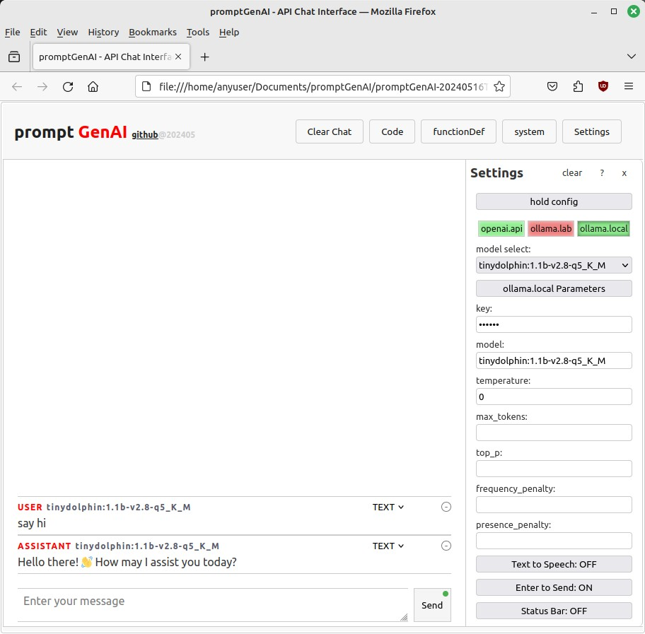

# PromptGenAI - AI API Endpoint Chat Interface

## Version 202407 - Configuration added for unofficial ollama_proxy.py  

- **ollama_proxy.py** [unofficial-ollama-helpers](https://github.com/aznight85048/unofficial-ollama-helpers) - A bare bones Python proxy server to bypass the common cors errors when attempting to use ollama serve API with a single work station browser setup.  If you have ollama installed and python accessible at your command line it should provide you with browser access to the ollama serve API via a proxy address. (no-framework--no containers--no 3rd party libraries--no external services)


## Related Projects

ollama_proxy.py and other home-brew troubleshooting utilities will be available here, [unofficial-ollama-helpers](https://github.com/aznight85048/unofficial-ollama-helpers) repository.


## Version 202406 - Interface Overhaul
- **Still No Framework Required** - Only need your browser
- **Voice-to-Text**: Easily convert spoken words into text for input.
- **Text-to-Voice**: Listen to AI-generated responses with text-to-speech functionality.
- **Phone Screen Support**: Optimized design for smaller screens, making it easier to use on mobile devices.
- **Enhanced User Interface**: Improved layout and usability for a better overall experience.
- **Improved API Integration**: Includes base configuration to Ollama and Open AI APIs for enhanced functionality.
- **Bug Fixes**: Addressed any issues from previous versions to enhance overall experience.

Don't forget to give the new features a try and let us know your feedback for further improvements!

## version 202405 - Now compatible with ollama and Open AI API


## Introduction
Welcome to **PromptGenAI**! This is a simple, no-framework HTML application designed to make it incredibly easy to interact with local and served AI models using Generative AI API Endpoints. If you're an Ollama user, especially if you're new to Large Language Models (LLMs) or have struggled with other interface setups, configurations, disappearing models, complicated installs, or containers, this project is for you! Our goal is to provide a user-friendly way to explore local LLMs without the need for complex frameworks or dependencies.

## Features
- **No Framework Required**: Just plain HTML, CSS, and JavaScript. Perfect for beginners and those who want to avoid complicated setups.
- **FlexBox Layout**: Responsive design with FlexBox to ensure a seamless experience across devices.
- **Generative AI Integration**: Easily connect to various AI APIs and explore the capabilities of Large Language Models.
- **Ollama-Friendly**: Specifically designed for quick and hassle-free interaction with Ollama models.

## Quick Start Guide for Ollama Users
> "Ollama installation instructions are provided as an option for users who do not already have access to an OpenAI API endpoint or those who wish to explore the capabilities of Ollama. Note that installing Ollama is NOT REQUIRED for PromptGenAI to function as a chat interface with other endpoints."

### Prerequisites
- A modern web browser.
- Access to Ollama AI.

### Steps

1. **Download Ollama via Linux Shell**:
    ```sh
    curl -fsSL https://ollama.com/install.sh | sh
    ```

2. **Pull a Small Model from Ollama's Library**:
    ```sh
    ollama pull tinydolphin:1.1b-v2.8-q5_K_M
    ```

3. **Open `promptGenAI.html` with your browser**:
   - Note: The actual `promptGenAI.html` file name may include a date/time stamp. Ensure you have the correct file in the directory where you saved it.

4. **Troubleshooting** (ollama.local 'red' indicator - typically due to cors issue)
   If there are issues, two additional commands should get you started. While not a perfect solution, these commands should enable you to start chatting with the downloaded local models:
    ```sh
    systemctl stop ollama
    OLLAMA_ORIGINS=* OLLAMA_HOST=127.0.0.1:11434 OLLAMA_MODELS=/usr/share/ollama/.ollama/models ollama serve
    ```
   **NOTE1:** Step 4 Troubleshooting is a quick fix (restarts ollama with your user) and
              will need to be re-done every time the ollama serve session is restarted.
   
   **NOTE2:** DO NOT 'ollama pull models' after executng Step 4 Troubleshooting.
              Restart session before pulling additional models.
              Restarting session restarts with the initial configuration (user:ollama)
   
    **Ollama "API Key":** While ollama does not require an API Key, this application checks for the presence of an API Key. When using ollama endpoints, you can use the word 'ollama' or any other value in the API Key field to satisfy the application's API Key requirement
   
   
## Usage
- Select a model from the list, 'Enter your message', and click send.
- Follow the on-screen prompts to interact with the AI models.
- Ensure you have your API keys ready and configured as needed.

## Demo (screenshot version 202405)



## Contributing
Suggestions and feedback are always welcome! Please fork this repository and submit pull requests.

## License
This project is licensed under the MIT License. See the [LICENSE](LICENSE) file for details.

## Contact
For any questions or suggestions, please feel free to open an issue or contact me directly at [aznight85048@gmail.com](mailto:aznight85048@gmail.com).

---

## Special Note to Ollama Users
I understand the challenges you might face with other interface setups and configurations (I know how frustrating it can be). **PromptGenAI** is designed to offer you a seamless and straightforward experience. Dive right into exploring local Large Language Models without the hassle of complicated installs or disappearing models. I'll do my best to make help make this journey with LLMs enjoyable and productive!

---

**Keywords**: local large language models, , lllm, no framework, ollama, generative ai, simple ai ui, ai for beginners, local llm, api, endpoint, vanilla, javascript, no external libraries, no 3rd party extensions, no containers, webui alternative, web ui alternative, openweb ui alternative, simple
